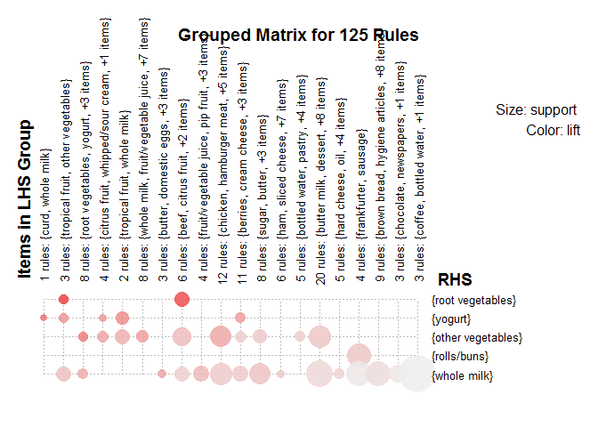
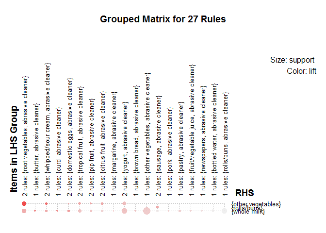

Groceries Store - Apriori Association Rule Mining
================

Project Brief
=============

-   We have data of transactions from a grocery store. Each transactions contains one or more items purchased by various customers.We will try to find out buying patterns in the transactions and use the insights to build a better business model for the store. Based on user behaviour we will try to model the algorithm so that we can drive higher sales. - We will be using the apriori algoritm to find association rules, also called Association Rules Mining.

Apriori Algorithm
=================

-   Apriori algorithm is based on conditional probabilities and helps us determine the likelihood of items being bought together based on a - priori data. There are three important parameters - support, confidence and lift. Suppose there a set of transactions with item1 --&gt; item 2. So support for item 1 will be defined by n(item1) / n(total transactions). Confidence on the other hand is defined as, n(item1 & item2) / n(item1). So, confidence tells us the strength of the association and support tells us the relevance of the rule. Because we dont want to include rules about items that are seldom bought, or in other words, have low support. Lift is Confidence/Support. Higher the lift, more the significance of applying the apriori algorithm to determine the rule.

Importing the Data
==================

``` r
library(arules)
# Importing the raw data in the form of transcations(using arules package)
groceries = read.transactions("D:/Machine Learning/groceries.csv",sep = ',',rm.duplicates = T)

summary(groceries)
```

    ## transactions as itemMatrix in sparse format with
    ##  9835 rows (elements/itemsets/transactions) and
    ##  169 columns (items) and a density of 0.02609146 
    ## 
    ## most frequent items:
    ##       whole milk other vegetables       rolls/buns             soda 
    ##             2513             1903             1809             1715 
    ##           yogurt          (Other) 
    ##             1372            34055 
    ## 
    ## element (itemset/transaction) length distribution:
    ## sizes
    ##    1    2    3    4    5    6    7    8    9   10   11   12   13   14   15 
    ## 2159 1643 1299 1005  855  645  545  438  350  246  182  117   78   77   55 
    ##   16   17   18   19   20   21   22   23   24   26   27   28   29   32 
    ##   46   29   14   14    9   11    4    6    1    1    1    1    3    1 
    ## 
    ##    Min. 1st Qu.  Median    Mean 3rd Qu.    Max. 
    ##   1.000   2.000   3.000   4.409   6.000  32.000 
    ## 
    ## includes extended item information - examples:
    ##             labels
    ## 1 abrasive cleaner
    ## 2 artif. sweetener
    ## 3   baby cosmetics

``` r
# So we have a set of 9835 transactions with 169 unique items.
# We also see that on average a customer buys 4.4 products and median is 3.0 products.  
```

We see the most frequently occuring items first
===============================================

``` r
itemFrequencyPlot(groceries,topN = 20)
```


-   The most commonly bought items are Whole milk, vegetables, rolls/buns, soda etc.

-   Now for applying the apriori algorithm, we need to set a minimum support and confidence. We are interested first in finding a larger set of rules. so we set support and confidence low.

Model fitting - Apriori
=======================

``` r
a1 = apriori(groceries,control = list(verbose = F),
             parameter = list(minlen = 2,supp = 0.01,conf = 0.3))

library(arulesViz)
head(inspect(sort(a1,by = 'confidence')),20) # to have a look at the rules 
```

    ##       lhs                           rhs                   support confidence     lift count
    ## [1]   {citrus fruit,                                                                       
    ##        root vegetables}          => {other vegetables} 0.01037112  0.5862069 3.029608   102
    ## [2]   {root vegetables,                                                                    
    ##        tropical fruit}           => {other vegetables} 0.01230300  0.5845411 3.020999   121
    ## [3]   {curd,                                                                               
    ##        yogurt}                   => {whole milk}       0.01006609  0.5823529 2.279125    99
    ## [4]   {butter,                                                                             
    ##        other vegetables}         => {whole milk}       0.01148958  0.5736041 2.244885   113
    ## [5]   {root vegetables,                                                                    
    ##        tropical fruit}           => {whole milk}       0.01199797  0.5700483 2.230969   118
    ## [6]   {root vegetables,                                                                    
    ##        yogurt}                   => {whole milk}       0.01453991  0.5629921 2.203354   143
    ## [7]   {domestic eggs,                                                                      
    ##        other vegetables}         => {whole milk}       0.01230300  0.5525114 2.162336   121
    ## [8]   {whipped/sour cream,                                                                 
    ##        yogurt}                   => {whole milk}       0.01087951  0.5245098 2.052747   107
    ## [9]   {rolls/buns,                                                                         
    ##        root vegetables}          => {whole milk}       0.01270971  0.5230126 2.046888   125
    ## [10]  {other vegetables,                                                                   
    ##        pip fruit}                => {whole milk}       0.01352313  0.5175097 2.025351   133
    ## [11]  {tropical fruit,                                                                     
    ##        yogurt}                   => {whole milk}       0.01514997  0.5173611 2.024770   149
    ## [12]  {other vegetables,                                                                   
    ##        yogurt}                   => {whole milk}       0.02226741  0.5128806 2.007235   219
    ## [13]  {other vegetables,                                                                   
    ##        whipped/sour cream}       => {whole milk}       0.01464159  0.5070423 1.984385   144
    ## [14]  {rolls/buns,                                                                         
    ##        root vegetables}          => {other vegetables} 0.01220132  0.5020921 2.594890   120
    ## [15]  {root vegetables,                                                                    
    ##        yogurt}                   => {other vegetables} 0.01291307  0.5000000 2.584078   127
    ## [16]  {fruit/vegetable juice,                                                              
    ##        other vegetables}         => {whole milk}       0.01047280  0.4975845 1.947371   103
    ## [17]  {butter}                   => {whole milk}       0.02755465  0.4972477 1.946053   271
    ## [18]  {curd}                     => {whole milk}       0.02613116  0.4904580 1.919481   257
    ## [19]  {whipped/sour cream,                                                                 
    ##        yogurt}                   => {other vegetables} 0.01016777  0.4901961 2.533410   100
    ## [20]  {other vegetables,                                                                   
    ##        root vegetables}          => {whole milk}       0.02318251  0.4892704 1.914833   228
    ## [21]  {other vegetables,                                                                   
    ##        tropical fruit}           => {whole milk}       0.01708185  0.4759207 1.862587   168
    ## [22]  {citrus fruit,                                                                       
    ##        yogurt}                   => {whole milk}       0.01026945  0.4741784 1.855768   101
    ## [23]  {root vegetables,                                                                    
    ##        whole milk}               => {other vegetables} 0.02318251  0.4740125 2.449770   228
    ## [24]  {domestic eggs}            => {whole milk}       0.02999492  0.4727564 1.850203   295
    ## [25]  {other vegetables,                                                                   
    ##        pork}                     => {whole milk}       0.01016777  0.4694836 1.837394   100
    ## [26]  {other vegetables,                                                                   
    ##        pastry}                   => {whole milk}       0.01057448  0.4684685 1.833421   104
    ## [27]  {onions}                   => {other vegetables} 0.01423488  0.4590164 2.372268   140
    ## [28]  {pork,                                                                               
    ##        whole milk}               => {other vegetables} 0.01016777  0.4587156 2.370714   100
    ## [29]  {whipped/sour cream,                                                                 
    ##        whole milk}               => {other vegetables} 0.01464159  0.4542587 2.347679   144
    ## [30]  {rolls/buns,                                                                         
    ##        yogurt}                   => {whole milk}       0.01555669  0.4526627 1.771563   153
    ## [31]  {citrus fruit,                                                                       
    ##        other vegetables}         => {whole milk}       0.01301474  0.4507042 1.763898   128
    ## [32]  {whipped/sour cream}       => {whole milk}       0.03223183  0.4496454 1.759754   317
    ## [33]  {pip fruit,                                                                          
    ##        whole milk}               => {other vegetables} 0.01352313  0.4493243 2.322178   133
    ## [34]  {root vegetables}          => {whole milk}       0.04890696  0.4486940 1.756031   481
    ## [35]  {rolls/buns,                                                                         
    ##        tropical fruit}           => {whole milk}       0.01098119  0.4462810 1.746587   108
    ## [36]  {sugar}                    => {whole milk}       0.01504830  0.4444444 1.739400   148
    ## [37]  {hamburger meat}           => {whole milk}       0.01474326  0.4434251 1.735410   145
    ## [38]  {ham}                      => {whole milk}       0.01148958  0.4414062 1.727509   113
    ## [39]  {sliced cheese}            => {whole milk}       0.01077783  0.4398340 1.721356   106
    ## [40]  {root vegetables}          => {other vegetables} 0.04738180  0.4347015 2.246605   466
    ## [41]  {bottled water,                                                                      
    ##        other vegetables}         => {whole milk}       0.01077783  0.4344262 1.700192   106
    ## [42]  {citrus fruit,                                                                       
    ##        whole milk}               => {other vegetables} 0.01301474  0.4266667 2.205080   128
    ## [43]  {other vegetables,                                                                   
    ##        soda}                     => {whole milk}       0.01392984  0.4254658 1.665124   137
    ## [44]  {frozen vegetables}        => {whole milk}       0.02043721  0.4249471 1.663094   201
    ## [45]  {tropical fruit,                                                                     
    ##        yogurt}                   => {other vegetables} 0.01230300  0.4201389 2.171343   121
    ## [46]  {other vegetables,                                                                   
    ##        rolls/buns}               => {whole milk}       0.01789527  0.4200477 1.643919   176
    ## [47]  {chicken}                  => {other vegetables} 0.01789527  0.4170616 2.155439   176
    ## [48]  {butter,                                                                             
    ##        whole milk}               => {other vegetables} 0.01148958  0.4169742 2.154987   113
    ## [49]  {hamburger meat}           => {other vegetables} 0.01382816  0.4159021 2.149447   136
    ## [50]  {cream cheese}             => {whole milk}       0.01647178  0.4153846 1.625670   162
    ## [51]  {butter milk}              => {whole milk}       0.01159126  0.4145455 1.622385   114
    ## [52]  {margarine}                => {whole milk}       0.02419929  0.4131944 1.617098   238
    ## [53]  {hard cheese}              => {whole milk}       0.01006609  0.4107884 1.607682    99
    ## [54]  {domestic eggs,                                                                      
    ##        whole milk}               => {other vegetables} 0.01230300  0.4101695 2.119820   121
    ## [55]  {chicken}                  => {whole milk}       0.01759024  0.4099526 1.604411   173
    ## [56]  {white bread}              => {whole milk}       0.01708185  0.4057971 1.588147   168
    ## [57]  {beef}                     => {whole milk}       0.02125064  0.4050388 1.585180   209
    ## [58]  {tropical fruit,                                                                     
    ##        whole milk}               => {other vegetables} 0.01708185  0.4038462 2.087140   168
    ## [59]  {tropical fruit}           => {whole milk}       0.04229792  0.4031008 1.577595   416
    ## [60]  {whipped/sour cream}       => {other vegetables} 0.02887646  0.4028369 2.081924   284
    ## [61]  {oil}                      => {whole milk}       0.01128622  0.4021739 1.573968   111
    ## [62]  {yogurt}                   => {whole milk}       0.05602440  0.4016035 1.571735   551
    ## [63]  {pip fruit}                => {whole milk}       0.03009659  0.3978495 1.557043   296
    ## [64]  {whole milk,                                                                         
    ##        yogurt}                   => {other vegetables} 0.02226741  0.3974592 2.054131   219
    ## [65]  {fruit/vegetable juice,                                                              
    ##        whole milk}               => {other vegetables} 0.01047280  0.3931298 2.031756   103
    ## [66]  {onions}                   => {whole milk}       0.01209964  0.3901639 1.526965   119
    ## [67]  {hygiene articles}         => {whole milk}       0.01281139  0.3888889 1.521975   126
    ## [68]  {brown bread}              => {whole milk}       0.02521607  0.3887147 1.521293   248
    ## [69]  {other vegetables}         => {whole milk}       0.07483477  0.3867578 1.513634   736
    ## [70]  {curd,                                                                               
    ##        whole milk}               => {yogurt}           0.01006609  0.3852140 2.761356    99
    ## [71]  {pork}                     => {whole milk}       0.02216573  0.3844797 1.504719   218
    ## [72]  {soda,                                                                               
    ##        yogurt}                   => {whole milk}       0.01047280  0.3828996 1.498535   103
    ## [73]  {other vegetables,                                                                   
    ##        sausage}                  => {whole milk}       0.01016777  0.3773585 1.476849   100
    ## [74]  {napkins}                  => {whole milk}       0.01972547  0.3766990 1.474268   194
    ## [75]  {beef}                     => {other vegetables} 0.01972547  0.3759690 1.943066   194
    ## [76]  {pork}                     => {other vegetables} 0.02165735  0.3756614 1.941476   213
    ## [77]  {pastry}                   => {whole milk}       0.03324860  0.3737143 1.462587   327
    ## [78]  {butter milk}              => {other vegetables} 0.01037112  0.3709091 1.916916   102
    ## [79]  {frozen vegetables}        => {other vegetables} 0.01779359  0.3699789 1.912108   175
    ## [80]  {dessert}                  => {whole milk}       0.01372649  0.3698630 1.447514   135
    ## [81]  {citrus fruit}             => {whole milk}       0.03050330  0.3685504 1.442377   300
    ## [82]  {fruit/vegetable juice}    => {whole milk}       0.02663955  0.3684951 1.442160   262
    ## [83]  {butter}                   => {other vegetables} 0.02003050  0.3614679 1.868122   197
    ## [84]  {long life bakery product} => {whole milk}       0.01352313  0.3614130 1.414444   133
    ## [85]  {citrus fruit,                                                                       
    ##        other vegetables}         => {root vegetables}  0.01037112  0.3591549 3.295045   102
    ## [86]  {tropical fruit,                                                                     
    ##        whole milk}               => {yogurt}           0.01514997  0.3581731 2.567516   149
    ## [87]  {berries}                  => {whole milk}       0.01179461  0.3547401 1.388328   116
    ## [88]  {other vegetables,                                                                   
    ##        whipped/sour cream}       => {yogurt}           0.01016777  0.3521127 2.524073   100
    ## [89]  {domestic eggs}            => {other vegetables} 0.02226741  0.3509615 1.813824   219
    ## [90]  {citrus fruit}             => {other vegetables} 0.02887646  0.3488943 1.803140   284
    ## [91]  {frankfurter}              => {whole milk}       0.02053889  0.3482759 1.363029   202
    ## [92]  {soda,                                                                               
    ##        whole milk}               => {other vegetables} 0.01392984  0.3477157 1.797049   137
    ## [93]  {cream cheese}             => {other vegetables} 0.01372649  0.3461538 1.788977   135
    ## [94]  {pip fruit}                => {other vegetables} 0.02613116  0.3454301 1.785237   257
    ## [95]  {other vegetables,                                                                   
    ##        tropical fruit}           => {root vegetables}  0.01230300  0.3427762 3.144780   121
    ## [96]  {other vegetables,                                                                   
    ##        tropical fruit}           => {yogurt}           0.01230300  0.3427762 2.457146   121
    ## [97]  {newspapers}               => {whole milk}       0.02735130  0.3426752 1.341110   269
    ## [98]  {tropical fruit}           => {other vegetables} 0.03589222  0.3420543 1.767790   353
    ## [99]  {sausage,                                                                            
    ##        whole milk}               => {other vegetables} 0.01016777  0.3401361 1.757876   100
    ## [100] {whipped/sour cream,                                                                 
    ##        whole milk}               => {yogurt}           0.01087951  0.3375394 2.419607   107
    ## [101] {margarine}                => {other vegetables} 0.01972547  0.3368056 1.740663   194
    ## [102] {citrus fruit,                                                                       
    ##        whole milk}               => {yogurt}           0.01026945  0.3366667 2.413350   101
    ## [103] {chocolate}                => {whole milk}       0.01667514  0.3360656 1.315243   164
    ## [104] {rolls/buns,                                                                         
    ##        yogurt}                   => {other vegetables} 0.01148958  0.3343195 1.727815   113
    ## [105] {beef}                     => {root vegetables}  0.01738688  0.3313953 3.040367   171
    ## [106] {waffles}                  => {whole milk}       0.01270971  0.3306878 1.294196   125
    ## [107] {white bread}              => {other vegetables} 0.01372649  0.3260870 1.685268   135
    ## [108] {frankfurter}              => {rolls/buns}       0.01921708  0.3258621 1.771616   189
    ## [109] {sausage}                  => {rolls/buns}       0.03060498  0.3257576 1.771048   301
    ## [110] {curd}                     => {yogurt}           0.01728521  0.3244275 2.325615   170
    ## [111] {curd}                     => {other vegetables} 0.01718353  0.3225191 1.666829   169
    ## [112] {coffee}                   => {whole milk}       0.01870869  0.3222417 1.261141   184
    ## [113] {sugar}                    => {other vegetables} 0.01077783  0.3183183 1.645119   106
    ## [114] {sausage}                  => {whole milk}       0.02989324  0.3181818 1.245252   294
    ## [115] {berries}                  => {yogurt}           0.01057448  0.3180428 2.279848   104
    ## [116] {pastry,                                                                             
    ##        whole milk}               => {other vegetables} 0.01057448  0.3180428 1.643695   104
    ## [117] {rolls/buns,                                                                         
    ##        whole milk}               => {other vegetables} 0.01789527  0.3159785 1.633026   176
    ## [118] {bottled water,                                                                      
    ##        whole milk}               => {other vegetables} 0.01077783  0.3136095 1.620783   106
    ## [119] {cream cheese}             => {yogurt}           0.01240468  0.3128205 2.242412   122
    ## [120] {dessert}                  => {other vegetables} 0.01159126  0.3123288 1.614164   114
    ## [121] {yogurt}                   => {other vegetables} 0.04341637  0.3112245 1.608457   427
    ## [122] {bottled water}            => {whole milk}       0.03436706  0.3109476 1.216940   338
    ## [123] {other vegetables,                                                                   
    ##        whole milk}               => {root vegetables}  0.02318251  0.3097826 2.842082   228
    ## [124] {berries}                  => {other vegetables} 0.01026945  0.3088685 1.596280   101
    ## [125] {rolls/buns}               => {whole milk}       0.05663447  0.3079049 1.205032   557

    ## NULL

``` r
# We get a set of 125 rules.

summary(a1) # we get a summary of the rules
```

    ## set of 125 rules
    ## 
    ## rule length distribution (lhs + rhs):sizes
    ##  2  3 
    ## 69 56 
    ## 
    ##    Min. 1st Qu.  Median    Mean 3rd Qu.    Max. 
    ##   2.000   2.000   2.000   2.448   3.000   3.000 
    ## 
    ## summary of quality measures:
    ##     support          confidence          lift           count      
    ##  Min.   :0.01007   Min.   :0.3079   Min.   :1.205   Min.   : 99.0  
    ##  1st Qu.:0.01149   1st Qu.:0.3454   1st Qu.:1.608   1st Qu.:113.0  
    ##  Median :0.01454   Median :0.3978   Median :1.789   Median :143.0  
    ##  Mean   :0.01859   Mean   :0.4058   Mean   :1.906   Mean   :182.8  
    ##  3rd Qu.:0.02217   3rd Qu.:0.4496   3rd Qu.:2.155   3rd Qu.:218.0  
    ##  Max.   :0.07483   Max.   :0.5862   Max.   :3.295   Max.   :736.0  
    ## 
    ## mining info:
    ##       data ntransactions support confidence
    ##  groceries          9835    0.01        0.3

``` r
plot(sort(a1,by = 'confidence'), method = "grouped")
```



-   We see that the inter quartile range for support lies between 0.011 & 0.022. So, we will choose 0.22 as the minimum support.

Iteration 2 - for optimization
==============================

``` r
a2 = apriori(groceries,control = list(verbose = F),
             parameter = list(minlen = 2,supp = 0.022,conf = 0.3))

quality(a2) = round(quality(a2),digits = 3)

#We also remove redundant rules

subset.matrix = is.subset(a2, a2, sparse = F)
subset.matrix[lower.tri(subset.matrix, diag= T)] = NA

redundant = colSums(subset.matrix,na.rm = T) >=1

which(redundant)
```

    ## {other vegetables,root vegetables,whole milk} 
    ##                                            28 
    ## {other vegetables,root vegetables,whole milk} 
    ##                                            29 
    ## {other vegetables,root vegetables,whole milk} 
    ##                                            30 
    ##          {other vegetables,whole milk,yogurt} 
    ##                                            31 
    ##          {other vegetables,whole milk,yogurt} 
    ##                                            32

``` r
rules.pruned = a2[!redundant]

plot(rules.pruned, method = "grouped")
```



``` r
a_sorted = inspect(sort(rules.pruned,by = 'confidence')) 
```

    ##      lhs                        rhs                support confidence
    ## [1]  {butter}                => {whole milk}       0.028   0.497     
    ## [2]  {curd}                  => {whole milk}       0.026   0.490     
    ## [3]  {domestic eggs}         => {whole milk}       0.030   0.473     
    ## [4]  {whipped/sour cream}    => {whole milk}       0.032   0.450     
    ## [5]  {root vegetables}       => {whole milk}       0.049   0.449     
    ## [6]  {root vegetables}       => {other vegetables} 0.047   0.435     
    ## [7]  {margarine}             => {whole milk}       0.024   0.413     
    ## [8]  {whipped/sour cream}    => {other vegetables} 0.029   0.403     
    ## [9]  {tropical fruit}        => {whole milk}       0.042   0.403     
    ## [10] {yogurt}                => {whole milk}       0.056   0.402     
    ## [11] {pip fruit}             => {whole milk}       0.030   0.398     
    ## [12] {brown bread}           => {whole milk}       0.025   0.389     
    ## [13] {other vegetables}      => {whole milk}       0.075   0.387     
    ## [14] {pork}                  => {whole milk}       0.022   0.384     
    ## [15] {pastry}                => {whole milk}       0.033   0.374     
    ## [16] {citrus fruit}          => {whole milk}       0.031   0.369     
    ## [17] {fruit/vegetable juice} => {whole milk}       0.027   0.368     
    ## [18] {domestic eggs}         => {other vegetables} 0.022   0.351     
    ## [19] {citrus fruit}          => {other vegetables} 0.029   0.349     
    ## [20] {pip fruit}             => {other vegetables} 0.026   0.345     
    ## [21] {newspapers}            => {whole milk}       0.027   0.343     
    ## [22] {tropical fruit}        => {other vegetables} 0.036   0.342     
    ## [23] {sausage}               => {rolls/buns}       0.031   0.326     
    ## [24] {sausage}               => {whole milk}       0.030   0.318     
    ## [25] {bottled water}         => {whole milk}       0.034   0.311     
    ## [26] {yogurt}                => {other vegetables} 0.043   0.311     
    ## [27] {rolls/buns}            => {whole milk}       0.057   0.308     
    ##      lift  count
    ## [1]  1.946 271  
    ## [2]  1.919 257  
    ## [3]  1.850 295  
    ## [4]  1.760 317  
    ## [5]  1.756 481  
    ## [6]  2.247 466  
    ## [7]  1.617 238  
    ## [8]  2.082 284  
    ## [9]  1.578 416  
    ## [10] 1.572 551  
    ## [11] 1.557 296  
    ## [12] 1.521 248  
    ## [13] 1.514 736  
    ## [14] 1.505 218  
    ## [15] 1.463 327  
    ## [16] 1.442 300  
    ## [17] 1.442 262  
    ## [18] 1.814 219  
    ## [19] 1.803 284  
    ## [20] 1.785 257  
    ## [21] 1.341 269  
    ## [22] 1.768 353  
    ## [23] 1.771 301  
    ## [24] 1.245 294  
    ## [25] 1.217 338  
    ## [26] 1.608 427  
    ## [27] 1.205 557

``` r
a_sorted
```

    ##                          lhs                   rhs support confidence
    ## [1]                 {butter} =>       {whole milk}   0.028      0.497
    ## [2]                   {curd} =>       {whole milk}   0.026      0.490
    ## [3]          {domestic eggs} =>       {whole milk}   0.030      0.473
    ## [4]     {whipped/sour cream} =>       {whole milk}   0.032      0.450
    ## [5]        {root vegetables} =>       {whole milk}   0.049      0.449
    ## [6]        {root vegetables} => {other vegetables}   0.047      0.435
    ## [7]              {margarine} =>       {whole milk}   0.024      0.413
    ## [8]     {whipped/sour cream} => {other vegetables}   0.029      0.403
    ## [9]         {tropical fruit} =>       {whole milk}   0.042      0.403
    ## [10]                {yogurt} =>       {whole milk}   0.056      0.402
    ## [11]             {pip fruit} =>       {whole milk}   0.030      0.398
    ## [12]           {brown bread} =>       {whole milk}   0.025      0.389
    ## [13]      {other vegetables} =>       {whole milk}   0.075      0.387
    ## [14]                  {pork} =>       {whole milk}   0.022      0.384
    ## [15]                {pastry} =>       {whole milk}   0.033      0.374
    ## [16]          {citrus fruit} =>       {whole milk}   0.031      0.369
    ## [17] {fruit/vegetable juice} =>       {whole milk}   0.027      0.368
    ## [18]         {domestic eggs} => {other vegetables}   0.022      0.351
    ## [19]          {citrus fruit} => {other vegetables}   0.029      0.349
    ## [20]             {pip fruit} => {other vegetables}   0.026      0.345
    ## [21]            {newspapers} =>       {whole milk}   0.027      0.343
    ## [22]        {tropical fruit} => {other vegetables}   0.036      0.342
    ## [23]               {sausage} =>       {rolls/buns}   0.031      0.326
    ## [24]               {sausage} =>       {whole milk}   0.030      0.318
    ## [25]         {bottled water} =>       {whole milk}   0.034      0.311
    ## [26]                {yogurt} => {other vegetables}   0.043      0.311
    ## [27]            {rolls/buns} =>       {whole milk}   0.057      0.308
    ##       lift count
    ## [1]  1.946   271
    ## [2]  1.919   257
    ## [3]  1.850   295
    ## [4]  1.760   317
    ## [5]  1.756   481
    ## [6]  2.247   466
    ## [7]  1.617   238
    ## [8]  2.082   284
    ## [9]  1.578   416
    ## [10] 1.572   551
    ## [11] 1.557   296
    ## [12] 1.521   248
    ## [13] 1.514   736
    ## [14] 1.505   218
    ## [15] 1.463   327
    ## [16] 1.442   300
    ## [17] 1.442   262
    ## [18] 1.814   219
    ## [19] 1.803   284
    ## [20] 1.785   257
    ## [21] 1.341   269
    ## [22] 1.768   353
    ## [23] 1.771   301
    ## [24] 1.245   294
    ## [25] 1.217   338
    ## [26] 1.608   427
    ## [27] 1.205   557

-   Now having looked at the rules , we trim them further by putting the lift &gt; 1.5

``` r
a_sorted = a_sorted[a_sorted$lift>1.5,]

summary(a_sorted)
```

    ##                    lhs                            rhs    
    ##  {domestic eggs}     :2   =>:20   {other vegetables}: 7  
    ##  {pip fruit}         :2           {rolls/buns}      : 1  
    ##  {root vegetables}   :2           {whole milk}      :12  
    ##  {tropical fruit}    :2                                  
    ##  {whipped/sour cream}:2                                  
    ##  {yogurt}            :2                                  
    ##  (Other)             :8                                  
    ##     support          confidence          lift           count      
    ##  Min.   :0.02200   Min.   :0.3110   Min.   :1.505   Min.   :218.0  
    ##  1st Qu.:0.02600   1st Qu.:0.3505   1st Qu.:1.577   1st Qu.:257.0  
    ##  Median :0.03000   Median :0.4000   Median :1.764   Median :295.5  
    ##  Mean   :0.03510   Mean   :0.3998   Mean   :1.749   Mean   :345.8  
    ##  3rd Qu.:0.04225   3rd Qu.:0.4385   3rd Qu.:1.823   3rd Qu.:418.8  
    ##  Max.   :0.07500   Max.   :0.4970   Max.   :2.247   Max.   :736.0  
    ## 

``` r
dim(a_sorted)
```

    ## [1] 20  7

``` r
a_sorted
```

    ##                       lhs                   rhs support confidence  lift
    ## [1]              {butter} =>       {whole milk}   0.028      0.497 1.946
    ## [2]                {curd} =>       {whole milk}   0.026      0.490 1.919
    ## [3]       {domestic eggs} =>       {whole milk}   0.030      0.473 1.850
    ## [4]  {whipped/sour cream} =>       {whole milk}   0.032      0.450 1.760
    ## [5]     {root vegetables} =>       {whole milk}   0.049      0.449 1.756
    ## [6]     {root vegetables} => {other vegetables}   0.047      0.435 2.247
    ## [7]           {margarine} =>       {whole milk}   0.024      0.413 1.617
    ## [8]  {whipped/sour cream} => {other vegetables}   0.029      0.403 2.082
    ## [9]      {tropical fruit} =>       {whole milk}   0.042      0.403 1.578
    ## [10]             {yogurt} =>       {whole milk}   0.056      0.402 1.572
    ## [11]          {pip fruit} =>       {whole milk}   0.030      0.398 1.557
    ## [12]        {brown bread} =>       {whole milk}   0.025      0.389 1.521
    ## [13]   {other vegetables} =>       {whole milk}   0.075      0.387 1.514
    ## [14]               {pork} =>       {whole milk}   0.022      0.384 1.505
    ## [18]      {domestic eggs} => {other vegetables}   0.022      0.351 1.814
    ## [19]       {citrus fruit} => {other vegetables}   0.029      0.349 1.803
    ## [20]          {pip fruit} => {other vegetables}   0.026      0.345 1.785
    ## [22]     {tropical fruit} => {other vegetables}   0.036      0.342 1.768
    ## [23]            {sausage} =>       {rolls/buns}   0.031      0.326 1.771
    ## [26]             {yogurt} => {other vegetables}   0.043      0.311 1.608
    ##      count
    ## [1]    271
    ## [2]    257
    ## [3]    295
    ## [4]    317
    ## [5]    481
    ## [6]    466
    ## [7]    238
    ## [8]    284
    ## [9]    416
    ## [10]   551
    ## [11]   296
    ## [12]   248
    ## [13]   736
    ## [14]   218
    ## [18]   219
    ## [19]   284
    ## [20]   257
    ## [22]   353
    ## [23]   301
    ## [26]   427

``` r
# Finally,we get a set of 20 rules with a minimum confidence of 0.3 , min lift of 1.5 and min support of  0.22
```
